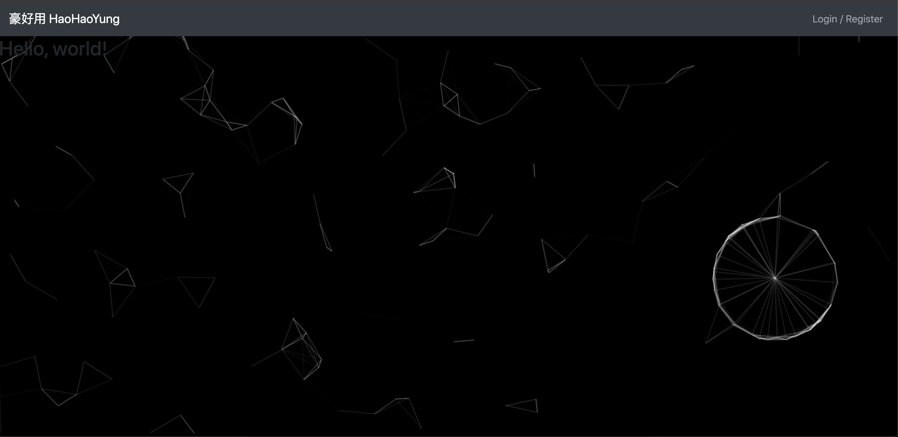
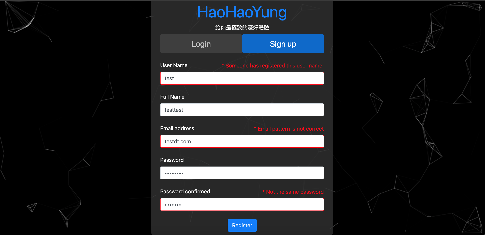
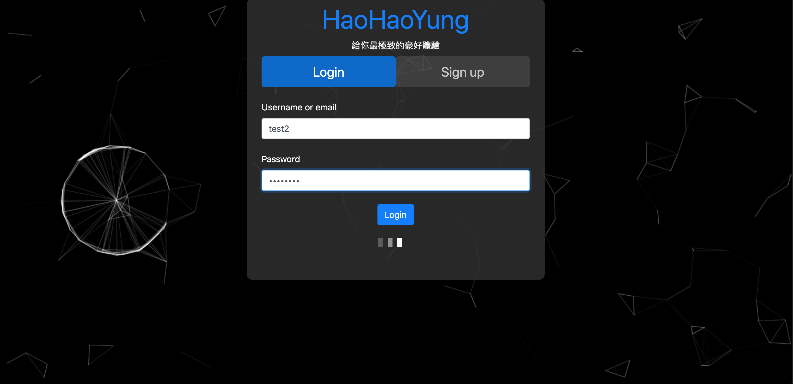
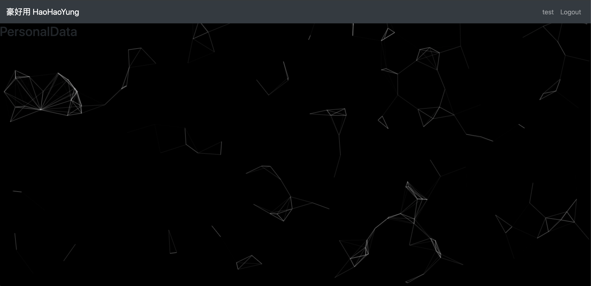

# Frontend Account System

**The backend of this project can be used with [this](https://gitlab.com/wwieo055169/nodebackend)**  

* Functions can be used from now on:
    * Register / Login

## To do list

* Install package first:
```
npm i
```

* Set the routes:
    * [Backend api](./src/controller/api_check/)  
    * [Port](./package.json) (default is 8000)  
  
* Then you can run this project by the command below:
```
npm run start
```

## Result

****

****

****
